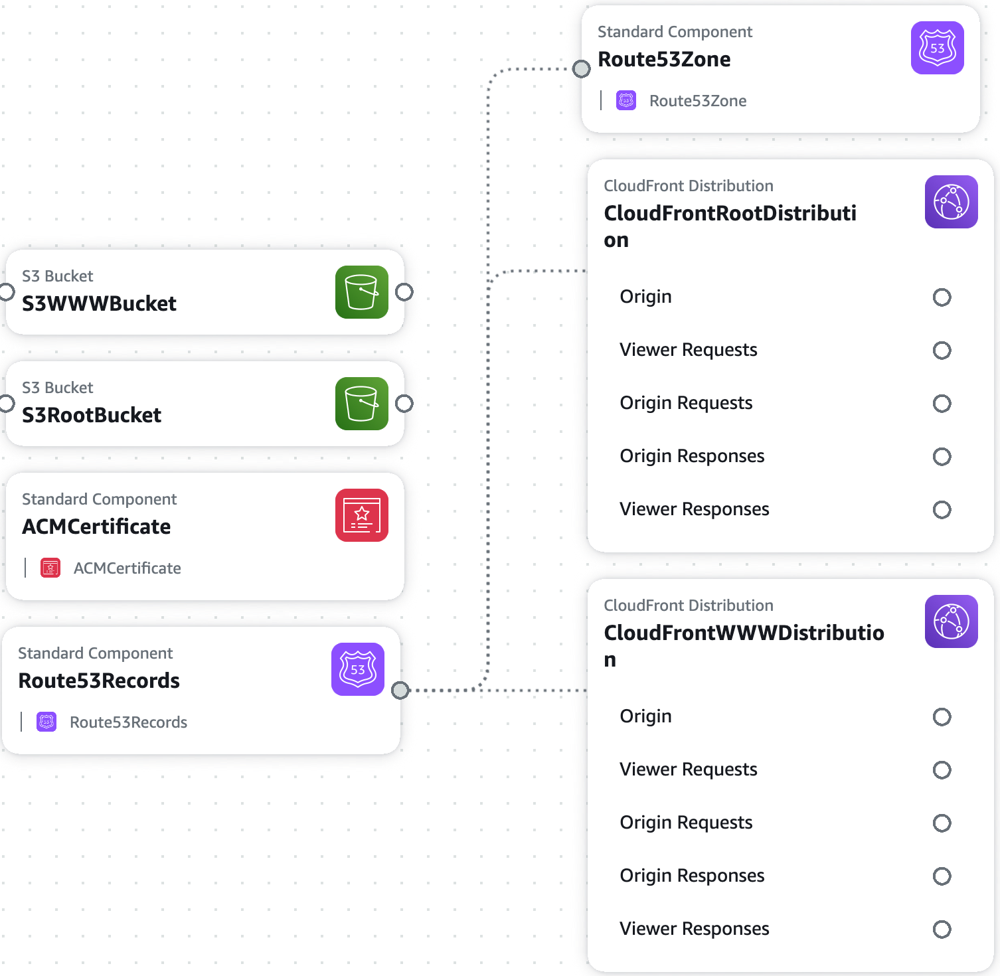

SCAR: 1-click static website deployment on AWS
==============================================

Tired of reading outdated blog posts or combing through verbose AWS
documentation just to figure out how to deploy your blog? Deploying static
websites on AWS shouldn't be so *scar*y.

**SCAR** is a deployment stack that make it easy for you to deploy a
static website with a custom domain, SSL, and a CDN. All you need is an AWS
account to get started in three simple steps:

Quick Start
-----------

#### 1. Launch a new stack using the AWS console to create all the required resources

#### 2. Update the settings at your domain registrar to use the Route 53 name servers

Find the name servers from your newly created [Route 53 hosted zone](https://console.aws.amazon.com/route53/home?#hosted-zones:),
then update the [name server settings at your registrar](#name-server-settings).

#### 3. Validate the domain for your new [ACM certificate](https://console.aws.amazon.com/acm/home)

Find and expand the details of the certificate for your domain in the AWS console, then click the
*"Create record in Route 53"* buttons in the two prompts for validation.

**_That's all, folks!_**

Use the [CloudFormation](https://console.aws.amazon.com/cloudformation/home)
console to check the status of the stack. Once it has been created, navigate to
your given domain, and you should see the SCAR welcome page.  You can now upload
the contents of your website directly with the [S3
console](https://s3.console.aws.amazon.com/s3/home), or use the [AWS
CLI](https://aws.amazon.com/cli/) for programmatic control.

Stack
-----

**SCAR** is a deployment stack for static websites running entirely on AWS, using **S**3,
**C**loudFront, **A**mazon Certificate Manager, and **R**oute 53. For a given
domain such as `example.com`, the default SCAR stack will create the following:

* Two S3 buckets, one for storing the contents of your static website
  (`www.example.com`) and another for redirecting requests for the apex domain
  (`example.com`) to the `www` subdomain.
* Two CloudFront distributions, one for each S3 bucket.
* One ACM public SSL/TLS certificate for both `example.com` and `*.example.com`
* One Route 53 hosted zone, with an `A` record for each CloudFront distribution.

The behavior for the default SCAR stack is to redirect all requests for the apex
domain to the `www` subdomain, and to redirect all `http` requests to `https`.
All content will be stored in and served out of the `www` S3 bucket.

Additional stacks with slight variations from the default stack are also
available:

| Behavior | Default | WWW->Apex | Apex only |
|----------|---------|-----------|-----------|
| Apex domain requests | Redirect to `www` | | |
| `www` subdomain requests | | Redirect to apex domain | N/A |
| `http` requests | Redirect to `https` | Redirect to `https` | Redirect to `https` |
| |  | (Coming Soon) | (Coming Soon) |

Name Server Settings
--------------------

* [GoDaddy](https://www.godaddy.com/help/change-nameservers-for-my-domains-664)
* [Google Domains](https://support.google.com/domains/answer/3290309?hl=en)

FAQ
---

### How much will this cost?

For most sites, it will likely cost less than $1 per month. The cost for a Route 53 hosted zone is fixed at $0.50/month; the remaining CloudFront and S3 costs depend on the levels of traffic, but typically amount to a few cents for small levels of traffic.

### What tool did you use to draw the diagram above?

The [AWS CloudFormation Designer tool](https://console.aws.amazon.com/cloudformation/designer/home) allows drag-and-drop creation of templates, and also creates diagrams from existing JSON or YAML template files.

License
-------

Copyright © 2019-2022
